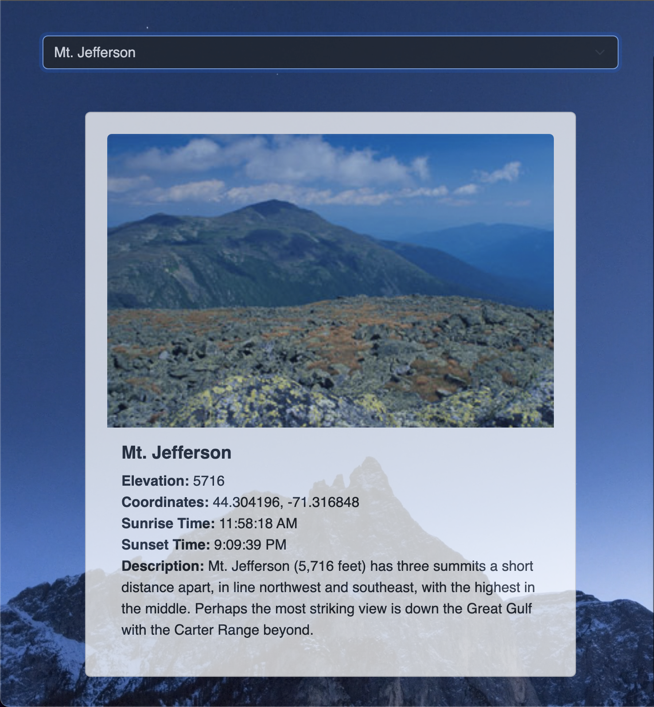
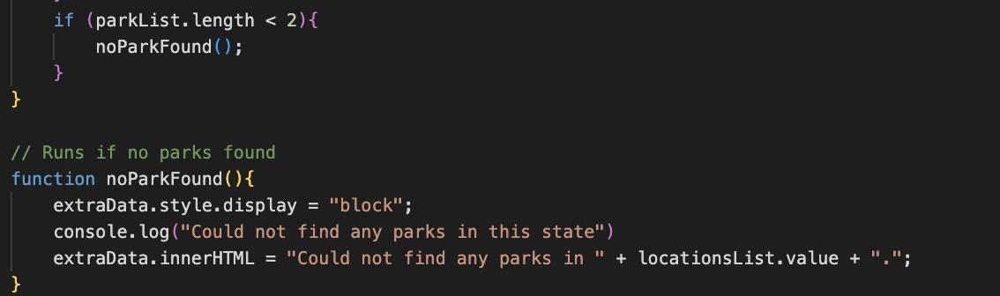

# Enjoy The Outdoors Capstone Project #2

The Rose Project's Enjoy The Outdoors website is intended to show the viewers of the page
the wonders the outside has to offer. 

Check it out: https://roseylikeme.github.io/enjoy-the-outdoors/

## Interesting Code
An interesting code of mine that I wrote is when I tried to create this fallback function "noParkFound". I noticed that there are several locations within the location array that don't populate any parks, for example: Deleware and Rhode Island.    The issue that may confuse people is that if they select those locations, the end users may believe that something is wrong with the code but it's just not populating. However that is not the case, thus I created the noParkFound function which basically says if "parkList.length < 2", or in other words, if there are no parks matching the location selected, then print in console that no parks were found AND display it.

